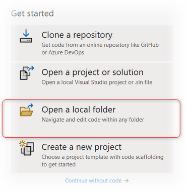
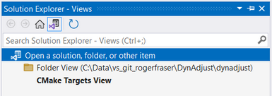
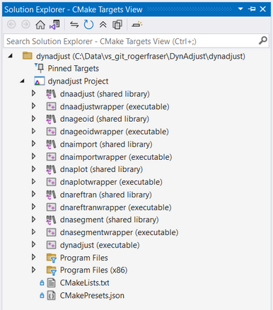

# Building DynAdjust from source code

The following build instructions are only needed if you would like to
build DynAdjust yourself or make changes to the source code and [contribute to the DynAdjust
repository](../.github/CONTRIBUTING.md), rather than use [pre-built
binaries](https://github.com/GeoscienceAustralia/DynAdjust/releases).


## Table of contents
- [Overview of prerequisites](#overview-of-prerequisites)
- [Linux (Ubuntu)](#linux-ubuntu)
  - [Installing prerequisites](#installing-prerequisites)
  - [Compile the source code](#compile-the-source-code)
- [MacOS](#macos)
  - [Install prerequisites](#install-prerequisites)
  - [Compile the source code](#compile-the-source-code-1)
- [Windows using Cmake](#windows-using-cmake)
  - [Install prerequisites](#install-prerequisites-1)
  - [Install Intel oneAPI MKL library](#install-intel-oneapi-mkl-library)
  - [Download the source code](#download-the-source-code)
  - [Compile the source code](#compile-the-source-code-2)
- [Windows using Visual Studio](#windows-using-visual-studio)
  - [Install Windows prerequisites](#install-windows-prerequisites)
  - [Building Windows binaries in Visual Studio](#building-windows-binaries-in-visual-studio)


## Overview of prerequisites

To build DynAdjust, the following prerequisites will be needed:

- A C++17 compiler (e.g. GCC, Clang, Microsoft Visual Studio C++)
- [CMake](https://cmake.org/)
- [Boost](https://www.boost.org)
- [Apache Xerces](https://xerces.apache.org/)
- [Codesynthesis XSD](https://www.codesynthesis.com/products/xsd/)
- BLAS and LAPACK, either
  [OpenBLAS](http://www.openmathlib.org/OpenBLAS/) or [Intel oneAPI Math
  Kernel
  Library](https://www.intel.com/content/www/us/en/developer/tools/oneapi/onemkl.html)

The way in which these prerequisites are installed will depend upon your
operating system and will be discussed in the following sections.

## Linux (Ubuntu)

For the case of Linux, we will give instructions on how to compile for
Ubuntu. The appropriate package manager commands will vary depending on
the Linux distribution that you use. We highly recommend trying the
[pre-built static
binaries](https://github.com/GeoscienceAustralia/DynAdjust/releases)
that we now generate that will work on any Linux distribution without
any dependencies (assuming a x64 platform).

### Installing prerequisites

Update package lists.

``` bash
sudo apt update
```

Install runtime and development prerequisites.

``` bash
sudo apt install -y libxerces-c-dev xsdcxx libboost-system-dev libboost-filesystem-dev libboost-timer-dev libboost-thread-dev libboost-program-options-dev
```

You now have two options,
either [OpenBLAS](http://www.openmathlib.org/OpenBLAS/) or [Intel oneAPI
Math Kernel
Library](https://www.intel.com/content/www/us/en/developer/tools/oneapi/onemkl.html).

#### OpenBLAS

For OpenBLAS, just run:

``` bash
sudo apt install -y libopenblas-dev liblapacke-dev
```

#### Intel oneAPI Math Kernel Library

Either download and install yourself manually, or run:

``` bash
wget https://registrationcenter-download.intel.com/akdlm/IRC_NAS/ac050ae7-da93-4108-823d-4334de3f4ee8/intel-oneapi-base-toolkit-2025.1.2.9_offline.sh -O oneapi.sh
sudo sh oneapi.sh -a --action install --components intel.oneapi.lin.mkl.devel --eula accept -s
```

### Compile the source code

Download an official release (e.g., 1.2.9) with:

``` bash
curl -O https://github.com/GeoscienceAustralia/DynAdjust/archive/refs/tags/v1.2.9.tar.gz
tar xvf v1.2.9.tar.gz
cd ~/DynAdjust-1.2.9
```

If you are using Intel MKL, then load it.

``` bash
source /opt/intel/oneapi/setvars.sh
```

Now, compile the code with CMake.

``` bash
mkdir build
cmake -S dynadjust -B build
cmake --build build --parallel
```

## MacOS

Building DynAdjust on MacOS is just as easy as Linux.

### Install prerequisites

Install Homebrew first if absent: visit <https://brew.sh> and run the
one-line install script.

Run the following commands to install the prerequisites.

``` bash
brew update
brew install boost xerces-c xsd
```

### Compile the source code

Download an official release (e.g., 1.2.9) with:

``` bash
curl -O https://github.com/GeoscienceAustralia/DynAdjust/archive/refs/tags/v1.2.9.tar.gz
tar xvf v1.2.9.tar.gz
cd ~/DynAdjust-1.2.9
```

If you are using Intel MKL, then load it.

``` bash
source /opt/intel/oneapi/setvars.sh
```

Now compile the code with cmake.

``` bash
mkdir build
cmake -S dynadjust -B build
cmake --build build --parallel
```

## Windows using Visual Studo and CMake

### Prerequisites

#### Install Microsoft Visual Studio 2022

Microsoft's Visual Studio 2022 Community Edition is available from
https://visualstudio.microsoft.com/vs/community/

C++ is required for compiling all DynAdjust binaries. MFC is only required
for building `GeoidInt.exe` - Geoid Interpolation software with a
(dialog-based) graphical user interface.

During installation, ensure C++ Desktop development and [CMake tools for Windows](https://learn.microsoft.com/en-us/cpp/build/cmake-projects-in-visual-studio?view=msvc-170#installation) components are installed.  Full instructions for installing and using packages with CMake in Visual studio can be found [here](https://learn.microsoft.com/en-us/vcpkg/get_started/get-started-vs?pivots=shell-cmd). Below is a brief summary of the steps.

#### Install git

On Windows, you will first need to install
[git](https://gitforwindows.org).

#### Install vcpkg

If you do not have [vcpkg](https://github.com/microsoft/vcpkg) installed, you can install it using the following steps.

``` cmd
git clone https://github.com/microsoft/vcpkg C:\vcpkg
C:\vcpkg\bootstrap-vcpkg.bat
```

#### Install dependency packages using vcpkg

Now we can install the dependencies.

``` cmd
vcpkg install boost-geometry boost-process boost-iostreams boost-spirit boost-system boost-filesystem boost-timer boost-thread boost-program-options boost-interprocess xerces-c
```

#### Install Code Synthesis XSD library

DynAdjust requires [Code Synthesis XSD](https://www.codesynthesis.com/products/xsd/) to parse XML files.  Since version 1.2.9, the CMake project file will automatically download XSD.  hence, there is no need to manually download and install it.

#### Install Intel oneAPI MKL library

If you do not have it, install the [Intel oneAPI Math Kernel Library {oneMKL)](https://www.intel.com/content/www/us/en/developer/tools/oneapi/onemkl.html). No extra configuration required because the installer registers MKL on the system PATH.  With Visual Studio 2022 already installed, the Intel oneMKL installer
will automatically enable integration into the Visual Studio 2022 IDE.
This means that the oneAPI MKL and TBB libraries and headers will be
automatically referenced upon compiling DynAdjust without modification.

### Download the DynAdjust source code

Download and unzip an official release (e.g. 1.2.8) to `C:\Data\Dev\` via the following command:

```cmd
cd C:\Data\Dev
curl https://github.com/GeoscienceAustralia/DynAdjust/archive/refs/tags/v1.2.8.zip -o DynaDjust-1.2.8.zip
tar -xf DynAdjust-1.2.8.zip
````

Alternativey, you can use git to get the latest version:

```cmd
cd C:\Data\Dev
git clone https://github.com/GeoscienceAustralia/DynAdjust.git C:\Data\Dev
```

### Option 1: Compile the source code via command prompt

``` cmd
cd path\to\DynAdjust
mkdir build
cmake -G "Visual Studio 17 2022" -A x64 -D USE_MKL=ON -D CMAKE_TOOLCHAIN_FILE="C:/vcpkg/scripts/buildsystems/vcpkg.cmake" -S dynadjust -B build
cmake --build build --config Release --parallel
```

### Option 2: Compile the source code via the Visual Studio IDE

Upon executing Visual Studio, select **Open a local folder** and navigate to the root folder where DynAdjust was extracted (above), where the top-most `CMakeLists.txt` file exists.



Upon opening this folder, Visual Studio will

* Add **CMake** items to the **Project** menu, with commands for viewing and editing CMake scripts.

* Display the folder structure and files in the **Solution Explorer** .

* Run CMake and generate the CMake cache file (`CMakeCache.txt`) for the default configuration. The CMake command line is displayed in the **Output Window**, along with other output from CMake.

* Start, in the background, to index the source files to enable IntelliSense, browsing information, refactoring, and so on. As you work, Visual Studio monitors changes in the editor and also on disk to keep its index in sync with the sources.

Once CMake cache generation has succeeded, you can also view your projects organized logically by targets. Choose the **Select View** button on the **Solution Explorer** toolbar. From the list in **Solution Explorer - Views**, select **CMake Targets View** and press **Enter** to open the targets view.



This will display all the DynAdjust *executables* and dependent *dynamic link library (DLL)* projects defined in the `CMakeLists.txt` file.



The project for each *executable* is named using the convention `dna<program-name>wrapper`, except for the main program `dynadjust`.
Upon compilation, these projects will create executables named `<program-name>.exe`. Each executable named `<program-name>.exe` is
dependent on a *DLL* named `dna<program-name>.dll`. The `CMakeLists.txt` file will ensure each dependency DLL is compiled first before compiling the executables.

The `CMakePresets.json` file manages four configurations:

1. Debug version with MKL (`build-dbg-mkl`)
2. Release version with MKL (`build-rel-mkl`)
3. Debug version with OpenBLAS (`build-dbg-openblas`)
4. Release version with OpenBLAS (`build-rel-openblas`)

To build DynAdjust:

1. Select the Build Configuration you would like to build (e.g. `build-rel-mkl`)
2. From the Project Menu, select **Delete Cache and Reconfigure**
3. Select **Build All**, or select the executable or DLL and then **Build*